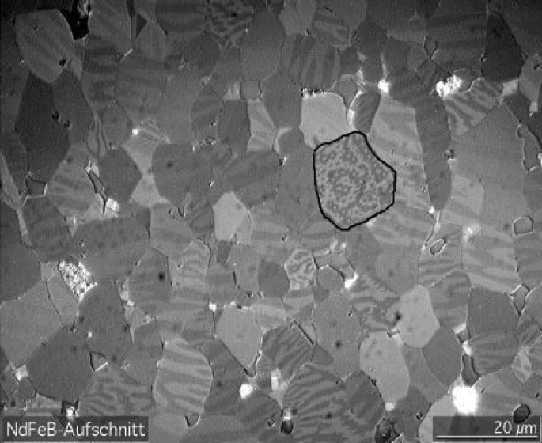
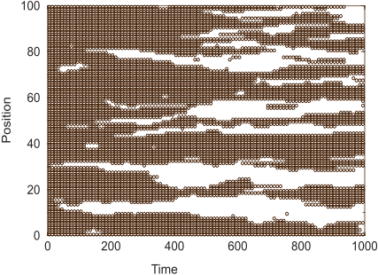
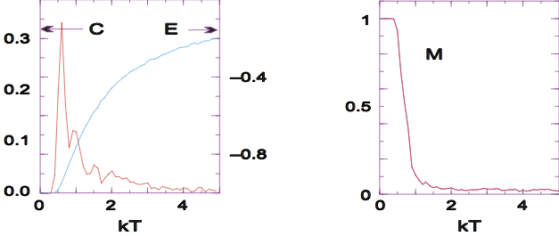

# Computational methods in Physics
## Week 11
#### Prof. Michael Wood-Vasey
##### [based on materials from Prof. Brian D'Urso]
##### University of Pittsburgh, Department of Physics and Astronomy

### Magnets

#### **Problem: Explain  Thermal Behavior of Ferromagnets**

#### What are Magnets and How Do They Behave?

*  Ferromagnets $= \sum$ finite **domains**   
*   Domain: all   atoms' spins aligned  
*   External $\vec{B}$:  align domains \imply **magnetized**  
*   $T\ \uparrow: \ \sum$  magnetism $\downarrow$ (spins flip?)  
*   @ $T_{curie}$: **phase transition**,  $\vec{M} \ =\ 0$   

### Ising Model

#### Ising Model:  $N$ Magnetic Dipoles on Linear Chain 

#### Constrained Many Body Quantum System

''                              |'' 
----------------------------- | --------------------
 * Same model 2-D, 3-D        | * Particle $i$,  spin
 * Fixed \imply no movements  | * $s_{i \equiv  s_{z,i} = \pm \frac{1}{2}$}
 * Spin dynamics              | *  $\Psi$:   $N$ spin values

$$
\left|\alpha_{j}\right \rangle  = \left|s_{1}, s_{2}, \ldots ,
s_{N} \right \rangle = \left\{\begin{array}{@{}c@{}} \displaystyle
\pm\frac{1}{2},\end{array}
\begin{array}{c}
 \displaystyle \pm\frac{1}{2},
\end{array}   \ldots \right\}, \quad
j=1,\ldots, 2^{N}
$$

#### Ising Model Continued

#### Quantum Interaction of $N$ Magnetic Dipoles

* $s_i = \uparrow, \downarrow$ \imply  $2^{N}$  states  
* Fixed \imply no exchange  
* Energy: $\vec{\mu}\cdot\vec{\mu}$ +  $\vec{\mu}\cdot\vec{B}$  
* $J$ = **exchange energy**

$$
**V_{i** = - J\vec{s}_{i}\cdot\vec{s}_{i+1} - g \mu_b\,
\vec{s}_{i}\cdot \vec{B}}
$$
 
 * $J>0$:  **ferromagnet** $\uparrow\uparrow\uparrow$  
 * $J<0$:    **antiferromagnet** $\uparrow\downarrow\uparrow\downarrow$  
*    $g$ = gyromagnetic ratio   
* $\vec{J} = g \vec{\mu}$  
*  $\mu_b = e\hbar/(2m_ec)$   

#### Many Body Problem ($N\ \geq \ 2, 3$ Unsolved)
 #### Beyond $N = $ 2, 3 Use Statistics, Approximations

 *   $2^{N}\ \rightarrow$ large  ($2^{20} > 10^6$)  
 * $10^{23}$: hah!  
 * $B_{ext}\rightarrow 0$ \imply no direction   
  * \imply $<\vec{M}> = 0$   
  * Yet  spins aligned??  
  *  Spontaneous reversal  

 $$
E_{\alpha_k} =  -J \sum_{i=1}^{N-1} s_{i}s_{i+1} - B
\mu_b\sum_{i=1}^{N} s_{i}
 $$

 * Not equilibrium **approach**   
 *  **Curie Temperature:** $\vec{M}(T>T_c) \equiv 0$   
 * $T<T_c$:  quantum  macroscopic order  
 * 1D: no phase transition   

### Stat Mech

#### Statistical Mechanics (Theory)

#### Microscopic Origin of Thermodynamics

*  Basis:  all configurations which satisfy constraints possible
*  \emph{Microcanonical Ensemble}:  **energy**  fixed
*  \emph{Canonical Ensemble}: (here) $T,\ V,\ N$ fixed, not $E$
*  **``At temperature $T$'':** \ equilibrium  $\langle E\rangle \propto T$
*  Equilibrium $\nRightarrow$ static  $\Rightarrow$ continual random fluctuates
*  Canonical ensemble:  $E_{\alpha}$  vary via Boltzmann ($k_B$):
 

   \begin{align*}
\protect{\cal P(E_{\alpha},T)\ =}&\  \frac{e^{-E_{\alpha/k_BT}}
{Z(T)}}  
Z(T)\ =&\ \sum_{\alpha}e^{-E_{\alpha}/k_BT}
 \end{align*}

 * Sum: individual states, not $g(E_{\alpha})$  weighted sum

### Analytic

#### Analytic Solutions $N\ \rightarrow\ \infty$ Ising Model

  **1-D Ising**
\begin{eqnarray}
&\displaystyle  U = \langle E \rangle &\$$3pt]
 &\displaystyle   \frac{U}{J} = - N \tanh \frac{J}{k_BT} =
-N\frac{e^{J/k_BT} -e^{-J/k_BT}}{e^{J/k_BT}+e^{-J/k_BT}}   =
 \begin{cases}
   N, &   k_BT\rightarrow 0 ,\$$6pt]
   0, &   k_BT\rightarrow \infty \end{cases}&
\end{eqnarray}
  \begin{eqnarray}
M(k_BT) & = &   \frac{N e^{J/k_BT}\sinh (B/k_BT)}{
\sqrt{e^{2J/k_BT}\sinh^2(B/k_BT) + e^{-2J/k_BT}} } .
 \end{eqnarray}
  **\large 2-D Ising**
   \begin{eqnarray}
 \protect{\cal M}(T) &=& \begin{cases} 0, &  T>T_c\$$8pt]
   \frac{(1+z^2)^{1/4}(1-6z^2+z^4)^{1/8}} {\sqrt{1-z^2}}, &   T<T_c
   ,\end{cases}\$$4pt]
k T_c &\ \simeq\ & 2.269185 J, \quad z= e^{-2J/k_BT},
   \end{eqnarray}

### Metropolis

### Metropolis Algorithm (A Top 10 Pick)

#### Basic Concepts (Mystery That It Works)

 * Boltzmann $\ \nRightarrow\ $ system remain  lowest $E$ state  
 * Boltzmann \imply  higher $E$ less likely than lower $E$  
 * $T \rightarrow 0$: only lowest $E$  
 * Finite $T$: $\ \Delta E \ \sim \ k_BT$  fluctuations $\sim$  equilibrium  
 * Metropolis,  Rosenbluth, Teller \& Teller: $n$ transport  
 * Clever way improve Monte Carlo averages  
 * Simulates thermal equilibrium fluctuations  
 * Randomly change spins,   $\langle$follows$\rangle\ \simeq$ Boltzmann  
 * Combo:   variance reduction \& von Neumann rejection  
 * Random, most likely predominant  

#### Metropolis Algorithm Implementation

#### Number of Steps, Multiple Paths to Equilibrium Configuration

1.
Start: fixed $T$,  arbitrary $\alpha_{k}=\{s_1,
s_2, \ldots, s_N\}, E_{\alpha_k}$  
  *  Trial:   flip random spin(s), calculate $E_{trial}$  

2. 
If $E_{trial} \leq E_{\alpha_{k}}$, accept: $\alpha_{k+1} = \alpha_{trial}$  

3.
If $E_{trial} > E_{\alpha_k}$, accept + relative probable $\protect{\cal R}
= e^{-\frac{\Delta E}{k_BT}}$:  
  *    Choose  uniform  $0 \leq r_i \leq 1$
  *   Set $\alpha_{k+1} =    \begin{cases}
\alpha_{trial}, & \mbox{if} \ \ \protect{\cal R} \geq r_j  \ \
\mbox{(accept)},\$$6pt]
\alpha_{k}, & \mbox{if}\ \ \protect{\cal R} < r_j \ \
\mbox{(reject)}.
\end{cases}$
  * Iterate, equilibrate (wait ${\simeq}10N$)  
  * Physics = fluctuations $\rightarrow$ $M(T)$, $U(T)$  
  * Change $T$, repeat  

#### Metropolis Algorithm Implementation (\texttt{\small IsingViz.py)}
 

 * Hot start: random
 * Cold start: parallel, anti
 * $>10N$ iterates no matter
 * More averages better
 \i
Data structure = \texttt{\small s[N]}
 * Print   $+$, $-$  ea site
 *  Periodic BC
 *  1st $J=k_BT=1$, $N \leq 20$
 *  Watch equilibrate: $\Delta$ starts
 *  Large flucts: $\uparrow$ $T$, $\downarrow$ $N$
 * Large $k_BT$: instabilities
 * Small $k_BT$: slow equilibrate
 *  Domain formation \& total $E$ ($E>0$: $\uparrow\downarrow$, $\downarrow\uparrow$)

## Calculate Thermodynamic Properties

#### Average in Equilibrium 100 spins

$$
E_{\alpha_j = - J\sum_{i=1} ^{N-1} s_{i}s_{i+1}},
\quad\quad {\cal M_{j} =  \sum_{i=1}^{N} s_{i}},  \quad\quad \uncover<4->{C_{simple}  =    \frac{1}{N} \frac{d\langle E \rangle}{dT}}
$$

*  $\vec{M(k_bT \rightarrow \infty) \rightarrow 0$}

* $\vec{M(k_bT \rightarrow 0) \rightarrow N/2$}

#### Simulated Annealing
Adapt the Metropolis Algorithm to "solve"   
optimization problems.

* Try to minimize an "energy" (or ``cost'') function $f$ over some parameter range or some space.
* Take Metropolis steps, starting at high $T$ and slowly decreasing $T$.
* The "solution" forms as the system cools - similar to annealing a metal.
* Not guaranteed to give global minimum.
* Can solve some problems with few other approaches.
* Easy to implement.
* Application: the "Traveling Salesman" problem.

